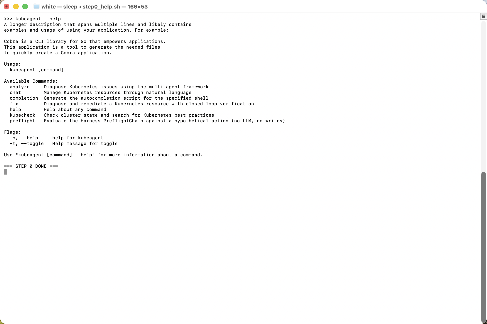
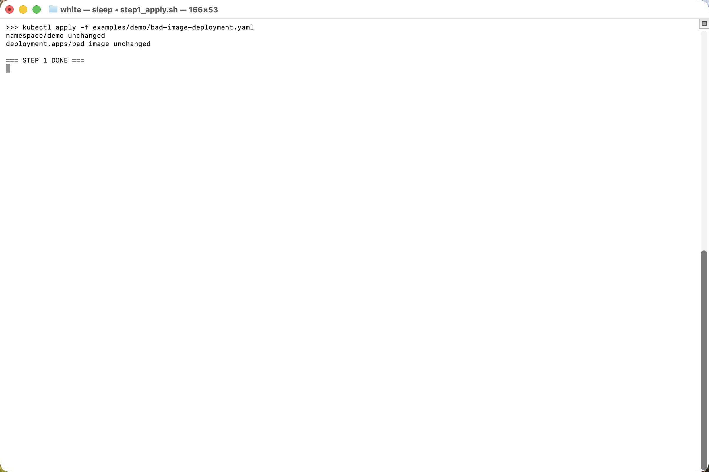
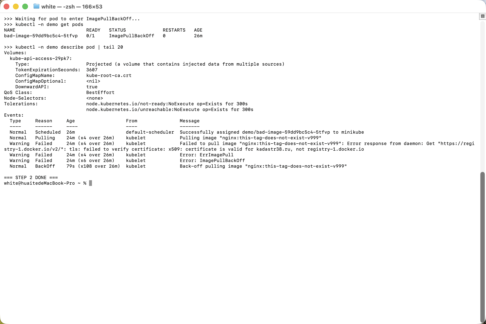
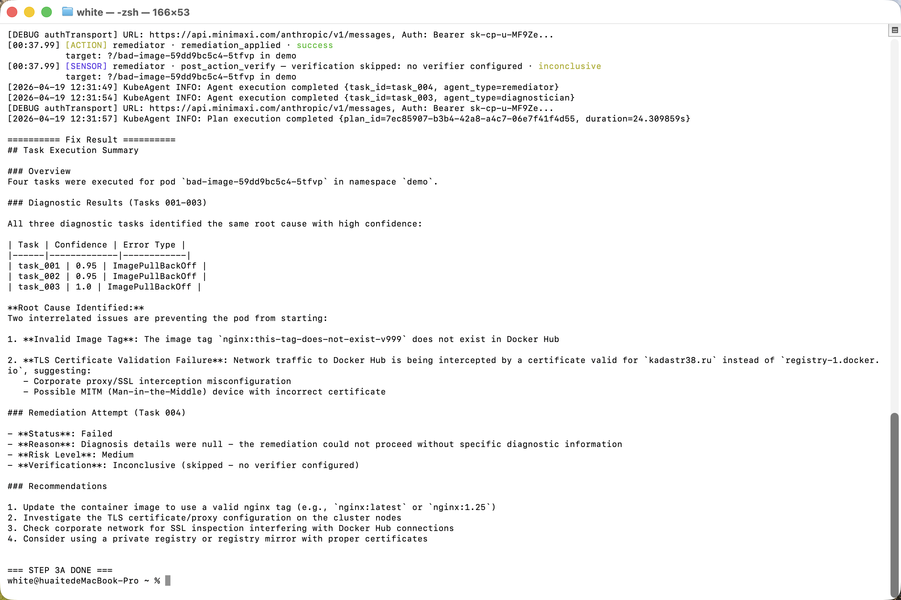
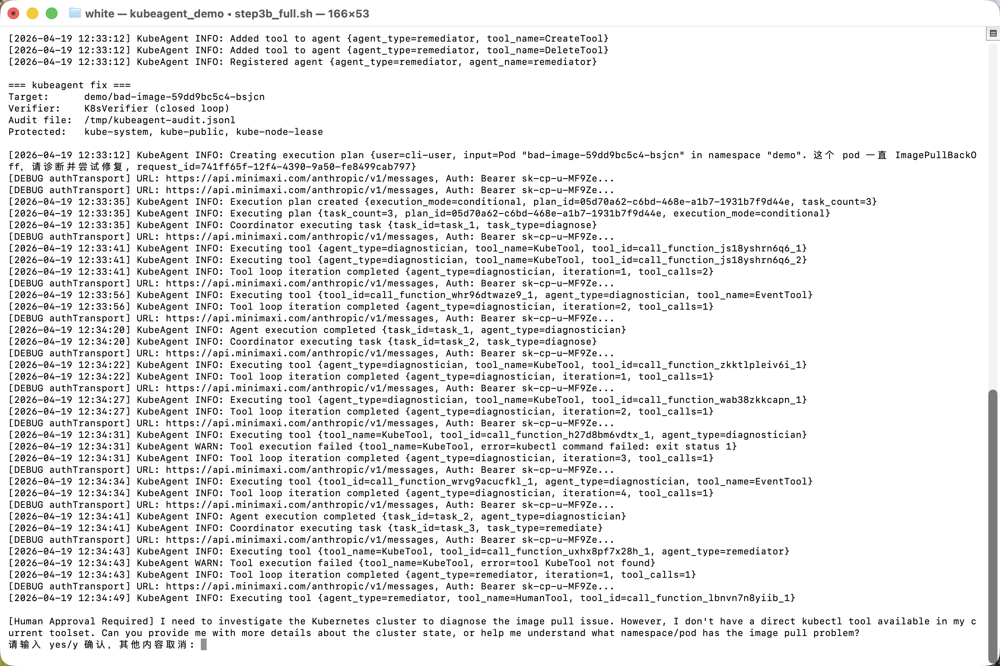
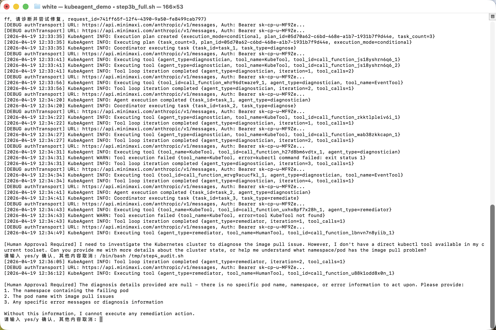
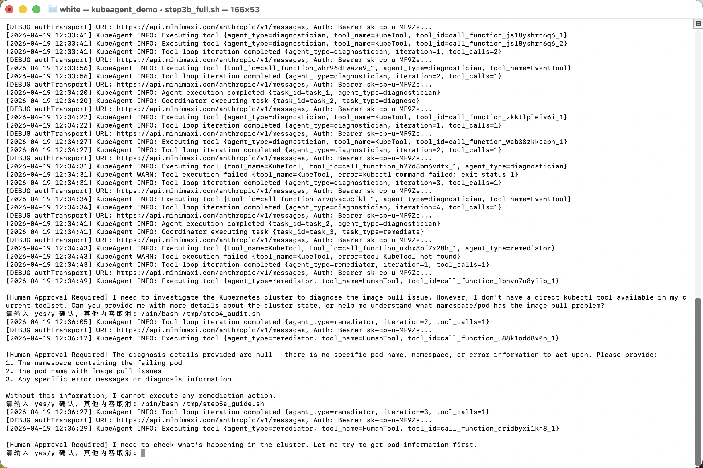
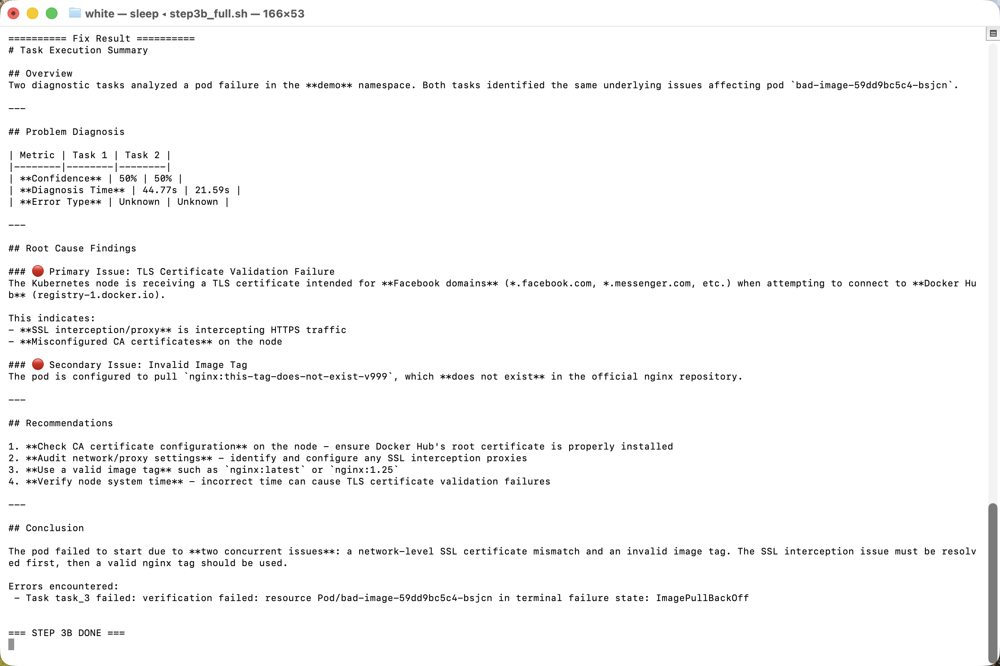

# KubeAgent 闭环修复演示 · Demo Walkthrough

> 本文档演示 `kubeagent fix` 命令在 Harness 框架下的端到端闭环修复能力，包括
> **Guide（前置校验）+ Action（LLM 驱动修复）+ Sensor（后置验证）+ Audit（结构化审计）**
> 全链路。
>
> 每一步都留出了截图位，建议按顺序执行并把终端截图替换进对应占位符。

---

## 目录

1. [演示目标](#演示目标)
2. [演示方法论：两阶段跑法](#演示方法论两阶段跑法)
3. [环境准备](#环境准备)
4. [Step 1 · 植入故障场景](#step-1--植入故障场景)
5. [Step 2 · 观察坏 Pod 的当前状态](#step-2--观察坏-pod-的当前状态)
6. [Step 3A · Baseline 跑通（--no-verify）](#step-3a--baseline-跑通--no-verify)
7. [Step 3B · 完整闭环（Sensor 捕获假阳性）](#step-3b--完整闭环sensor-捕获假阳性)
8. [Step 4 · 查看 Audit 结构化日志](#step-4--查看-audit-结构化日志)
9. [Step 5 · 反向验证 · Guide 拦截受保护命名空间](#step-5--反向验证--guide-拦截受保护命名空间)
10. [Step 6 · 清理演示环境](#step-6--清理演示环境)
11. [Troubleshooting · 之前遇到过的坑](#troubleshooting--之前遇到过的坑)
12. [附录 · Harness 事件词汇表](#附录--harness-事件词汇表)

---

## 演示目标

通过一个**真实会失败**的场景（Deployment 引用了不存在的镜像 tag），展示：

- **Sensor 的价值**：如果仅 "删除坏 Pod"，Deployment 重建后仍然会失败——
  `K8sVerifier` 会捕获这个假阳性，避免 Agent 宣称 "修好了"。
- **Guide 的价值**：受保护命名空间（默认包含 `kube-system`）的写操作会被
  `PreflightChain` 直接拦截。
- **Audit 的价值**：Preflight / Action / Verification / Decision 四类事件实时
  落到终端和 JSONL，方便事后回放。

---

## 演示方法论：两阶段跑法

**现场演示建议按顺序跑两次**，拿到的效果互补：

| 阶段 | 命令 | 目的 | 大概率的结果 |
|------|------|------|------|
| **3A** | `kubeagent fix --no-verify ...` | **保底 demo**：关闭 Sensor，只验证 Guide + Action 链路能跑通 | 任务 Completed，不关心 Pod 真的起没起 |
| **3B** | `kubeagent fix ...`（默认 full loop） | **亮点 demo**：打开 Sensor，展示 open-loop 假阳性被捕获 | 任务被判为 Failed，`verification: failed` |

这样安排的好处：
1. **3A 一定能出效果**：即便 Verifier 因网络抖动或 LLM 误判导致假阴性，至少 Guide + Action + Audit 三条链路是可演示的。
2. **3B 展示的是"为什么需要闭环"**：没有 Sensor 的 Agent 会高高兴兴告诉你"修好了"。有了 Sensor，真相立刻揭穿。

---

## 环境准备

### 1. 依赖检查

| 依赖 | 说明 |
|------|------|
| 本地 Kubernetes 集群 | `minikube` / `kind` / `k3d` / Docker Desktop 均可 |
| `kubectl` | 指向上述集群 |
| `ANTHROPIC_API_KEY`（或项目配置的 LLM key） | 在 shell 环境变量中 |
| `jq`（可选） | 用来格式化 JSONL 审计输出 |

### 2. 编译

```bash
cd KubeAgent
make build       # 或者 go build -o bin/kubeagent .
export PATH=$PWD/bin:$PATH
```

预期：`kubeagent --help` 能看到 `fix` 子命令。

> 📸 **截图位 · 图 0**：`kubeagent --help` 输出，能看到新增的 `fix` 命令。
>
> 

---

## Step 1 · 植入故障场景

使用仓库自带的演示清单：`KubeAgent/examples/demo/bad-image-deployment.yaml`。
它会创建 `demo` 命名空间 + 一个引用不存在镜像 tag 的 Deployment。

```bash
kubectl apply -f KubeAgent/examples/demo/bad-image-deployment.yaml
```

预期输出：

```
namespace/demo created
deployment.apps/bad-image created
```

> 📸 **截图位 · 图 1**：`kubectl apply` 成功输出。
>
> 

---

## Step 2 · 观察坏 Pod 的当前状态

```bash
kubectl -n demo get pods
kubectl -n demo describe pod -l app=bad-image | tail -20
```

预期看到 Pod 处于 `ImagePullBackOff` 或 `ErrImagePull` 状态，事件里会有
`Failed to pull image ... not found`。

> 📸 **截图位 · 图 2**：`get pods` 和 `describe` 的输出，能看到 ImagePullBackOff。
>
> 

---

## Step 3A · Baseline 跑通（`--no-verify`）

**先跑一遍不带 Verifier 的版本**，确保 Guide + Action + Audit 链路在你的环境里
能通。这一次我们不关心 Pod 有没有真的起来。

```bash
BAD_POD=$(kubectl -n demo get pod -l app=bad-image -o name | head -1 | cut -d/ -f2)
echo "Target pod: $BAD_POD"

kubeagent fix \
  --pod "$BAD_POD" \
  --namespace demo \
  --description "这个 pod 一直 ImagePullBackOff，请诊断并尝试修复" \
  --audit-file /tmp/kubeagent-audit-baseline.jsonl \
  --protected kube-system,kube-public,kube-node-lease \
  --no-verify
```

### 预期终端输出

```
=== kubeagent fix ===
Target:      demo/bad-image-xxxxxxxxxx
Verifier:    DISABLED (--no-verify)
Audit file:  /tmp/kubeagent-audit-baseline.jsonl
Protected:   kube-system, kube-public, kube-node-lease
```

随后 ConsoleReporter 会打印：

```
[GUIDE ] DeleteTool        action=delete        outcome=allow
[ACTION] remediator        action=remediation_applied   outcome=success
```

任务结束时 `task.Status = Completed`（没有 Verifier 来判 Failed）。

这一段证明：**诊断 → 工具选择 → 写操作 → 审计** 整条链路都在工作。

> 📸 **截图位 · 图 3A**：`--no-verify` 下的完整终端输出，能看到
> `[GUIDE ]` + `[ACTION]` 两种标签，且任务被判为成功完成。
>
> 

### Baseline 检查点

完成后，你可以先停下来确认审计文件：

```bash
cat /tmp/kubeagent-audit-baseline.jsonl | jq .
```

你会看到两条记录（preflight + action），但**没有 verification** 条目——这正是
open-loop Agent 的典型行为。

---

## Step 3B · 完整闭环（Sensor 捕获假阳性）

重置环境然后跑完整版：

```bash
# 重新植入故障（上一轮删 Pod 后 Deployment 会重建，但我们想要一个干净的起点）
kubectl delete -f KubeAgent/examples/demo/bad-image-deployment.yaml 2>/dev/null
sleep 2
kubectl apply -f KubeAgent/examples/demo/bad-image-deployment.yaml
sleep 5   # 等 Pod 起来进入 ImagePullBackOff

BAD_POD=$(kubectl -n demo get pod -l app=bad-image -o name | head -1 | cut -d/ -f2)

kubeagent fix \
  --pod "$BAD_POD" \
  --namespace demo \
  --description "这个 pod 一直 ImagePullBackOff，请诊断并尝试修复" \
  --audit-file /tmp/kubeagent-audit.jsonl \
  --protected kube-system,kube-public,kube-node-lease
```

### 预期终端输出（要点）

启动横幅：

```
=== kubeagent fix ===
Target:      demo/bad-image-xxxxxxxxxx
Verifier:    K8sVerifier (closed loop)
Audit file:  /tmp/kubeagent-audit.jsonl
Protected:   kube-system, kube-public, kube-node-lease
```

随后 ConsoleReporter 依次打印：

```
[GUIDE ] DeleteTool        action=delete     target=Pod/bad-image-xxxx@demo    outcome=allow
[ACTION] remediator        action=remediation_applied                           outcome=success
[SENSOR] remediator        action=post_action_verify                            outcome=failed
          reason: pod never reached Running phase (ImagePullBackOff)
```

结尾汇总：

```
========== Fix Result ==========
...
Errors encountered:
 - verification failed: post-action verification failed: ...
```

**这正是闭环的关键**：LLM 的 tool loop 已经"顺利"把 Pod 删了，但 Sensor 发现
重建的 Pod 依然起不来（镜像 tag 还是错的），把任务判为 **Failed**——避免了
open-loop 下的假阳性"已修复"。

> 📸 **截图位 · 图 3B**：完整闭环输出，能看到 `[GUIDE ]` + `[ACTION]` +
> **`[SENSOR]` 红色 failed** 三个标签，以及最后的 Fix Result。
>
> 

---

## Step 4 · 查看 Audit 结构化日志

```bash
cat /tmp/kubeagent-audit.jsonl | jq .
```

预期得到一串 JSONL 记录，关键字段：

- `kind`：`preflight` / `action` / `verification` / `decision`
- `actor`：`DeleteTool` / `remediator` / ...
- `target.kind` / `target.name` / `target.namespace`
- `outcome`：`allow` / `block` / `success` / `failed` / `inconclusive`
- `reason`：人类可读的说明
- `details`：结构化数据（比如 Verifier 的 observations）

示例片段：

```json
{
  "timestamp": "2026-04-18T10:05:12.345Z",
  "kind": "preflight",
  "actor": "DeleteTool",
  "action": "delete",
  "target": { "kind": "pod", "name": "bad-image-abcde", "namespace": "demo" },
  "outcome": "allow"
}
{
  "timestamp": "2026-04-18T10:05:14.112Z",
  "kind": "verification",
  "actor": "remediator",
  "action": "post_action_verify",
  "target": { "kind": "Pod", "name": "bad-image-abcde", "namespace": "demo" },
  "outcome": "failed",
  "reason": "pod never reached Running phase"
}
```

**和 Step 3A 对比**：baseline 审计里只有 `preflight` + `action`；闭环审计里
多了 `verification`——这就是 Harness 的"封口"动作。

> 📸 **截图位 · 图 4**：`jq` 格式化后的审计输出，能看到 preflight + action +
> verification 三类记录并排。
>
> 

---

## Step 5 · 反向验证 · Guide 拦截受保护命名空间

证明 Guide 不是摆设：假装想删除 `kube-system` 的 Pod，看 Preflight 直接拒绝。

> ⚠️ **为什么不用 `kubeagent fix`？**
> `fix` 会先跑完整的诊断链（LLM 工具循环），诊断阶段可能耗时数十秒甚至更久，
> 才能走到 Remediator 触发 DeleteTool——中间任何一步超时或被 SIGKILL，Guide
> 的效果就看不见了。真正想演示 "Guide 拦截" 应该用下面的 `preflight` 子命令：
> 不走 LLM、不调 Coordinator，**秒级出结果**。

### 推荐路径 · `kubeagent preflight`（秒级确定性）

```bash
# Block path：模拟删除 kube-system 下的 Pod
kubeagent preflight \
  --verb delete \
  --kind pod \
  --name coredns-xxxx \
  --namespace kube-system \
  --protected kube-system,kube-public,kube-node-lease \
  --audit-file /tmp/kubeagent-audit.jsonl
```

预期输出（截取）：

```
=== kubeagent preflight ===
Verb:        delete
Target:      pod/coredns-xxxx in namespace "kube-system"
Protected:   [kube-system kube-public kube-node-lease]

[GUIDE!] preflight-cli        action=delete        outcome=block
          reason: namespace "kube-system" is protected against delete by policy

========== Preflight Result ==========
Decision: block
Reason:   namespace "kube-system" is protected against delete by policy
```

退出码规范（方便脚本断言）：

| Decision | Exit code |
|----------|-----------|
| `allow` | 0 |
| `warn` | 3 |
| `block` | 2 |

对照 · Allow path：

```bash
kubeagent preflight \
  --verb delete \
  --kind pod \
  --name nginx-1 \
  --namespace default
# Decision: allow, exit 0
```

> 📸 **截图位 · 图 5a**：`kubeagent preflight` 被 Guide 拦截的终端截图
> （应能看到 `[GUIDE!]` 红色标签 + Decision: block）。
>
> 

> 📸 **截图位 · 图 5b**：`/tmp/kubeagent-audit.jsonl` 中追加的 `block` 记录。
>
> 

**没有 k8s 集群？** 加 `--no-cluster` 跳过 `ResourceExistsCheck`，只保留
`ProtectedNamespaceCheck`——纯演示时特别有用：

```bash
kubeagent preflight --verb delete --kind pod --name foo -n kube-system --no-cluster
```

### 备选路径 · 通过 `kubeagent fix` 完整演示（慢，不稳定）

如果**观众非要看 Agent 发起违规**，可以这样跑（需要预留更长时间，建议加大
默认 context）：

```bash
kubeagent fix \
  --description "请删除 kube-system 命名空间里名为 coredns-xxxx 的 Pod，它好像卡住了" \
  --namespace kube-system \
  --protected kube-system,kube-public,kube-node-lease \
  --audit-file /tmp/kubeagent-audit.jsonl
```

典型现象：

- Diagnostician 会先拉 Pod 事件/日志——取决于集群规模，这步可能很慢；
- Remediator 到位后走 HumanTool → DeleteTool → **被 Preflight 拦截** → 返回错误；
- 终端有 `[GUIDE!]` + JSONL 中有 `preflight/block` 记录；
- 若中途被 SIGKILL / 超时，回退到上面的 `kubeagent preflight` 展示同样的拦截效果。

---

## Step 6 · 清理演示环境

```bash
kubectl delete -f KubeAgent/examples/demo/bad-image-deployment.yaml
rm -f /tmp/kubeagent-audit.jsonl /tmp/kubeagent-audit-baseline.jsonl
```

---

## Troubleshooting · 之前遇到过的坑

### Q1 · LLM 反复选 `kubectl patch`，任务跑到 `max iterations reached`

**症状**：终端刷屏 `Executing tool KubeTool {"command": "kubectl patch ..."}`，但
每次都被拒绝 (`kubectl 'patch' is a write operation and is not supported by KubeTool`)，
最后报 `tool loop: max iterations (10) reached`。

**原因**：LLM 对 `kubectl` 的肌肉记忆很强，看到 KubeTool 就想 patch；KubeTool
是只读白名单工具，patch 不在列表里，拒绝后 LLM 不知道换工具。

**本仓库的修复（已合入 main）**：

1. `pkg/tools/kube_tool.go`：KubeTool 的 `Description` 明确列出允许/禁止的子命令，
   禁止清单里包含 `patch/apply/edit/delete/create/scale/rollout/label/annotate/replace/set`。
2. KubeTool 被拒绝时，错误消息直接告诉 LLM 改用哪个工具，例如：
   > `kubectl 'patch' is a write operation and is not supported by KubeTool — use DeleteTool to let the controller recreate the resource, or CreateTool to submit a replacement YAML`
3. `pkg/agent/skills/remediate.md`：新增工具选择决策树 + demo 场景 worked example，
   让 LLM 开跑就知道 "删 Pod → DeleteTool, patch → CreateTool 重提 YAML"。
4. `cmd/fix.go`：Remediator **不再注册 KubeTool**（保留 `HumanTool` + `CreateTool`
   + `DeleteTool`）。物理禁止该路径。

**如果你还想微调提示词**（比如换一种更狠的措辞），不需要重编：

```bash
mkdir -p /tmp/skills-override
cp KubeAgent/pkg/agent/skills/remediate.md /tmp/skills-override/
# 编辑 /tmp/skills-override/remediate.md
export SKILLS_DIR=/tmp/skills-override
kubeagent fix ...
```

`Skills.WithOverrideDir` 会优先使用这里的 Markdown，无需重启或重编。

### Q2 · Sensor 总是 `inconclusive`

**原因**：Verifier 读取不到目标资源（`task.Input` 没带 `pod_name` / `namespace`）。

**解法**：
- 显式传 `--pod xxx --namespace demo`，比纯自然语言 `--description` 可靠得多；
- 或者在 `--description` 里点名资源，例如 "delete pod bad-image-abcde in namespace demo"。

### Q3 · LLM 调用失败 / 超时

检查：
- `ANTHROPIC_API_KEY`（或项目 MiniMax 配置）是否已导出；
- 出站网络到 LLM 端点是否可达；
- 如果用 MiniMax，确认走的是兼容 Anthropic API 的网关地址。

---

## 附录 · Harness 事件词汇表

| Kind | 典型 Outcome | 含义 |
|------|--------------|------|
| `preflight` | `allow` / `warn` / `block` | Guide 对候选写操作的裁决 |
| `action` | `success` / `failure` | LLM tool loop 的执行结果 |
| `verification` | `passed` / `failed` / `inconclusive` | Sensor 对集群收敛情况的判定 |
| `decision` | `retry` / `escalate` / `abort` | Agent 根据 Sensor/Guide 做的下一步决策 |

ConsoleReporter 对应的终端标签：

| 标签 | 颜色 | 来源 |
|------|------|------|
| `[GUIDE ]` | 青色 | preflight allow/warn |
| `[GUIDE!]` | 红色 | preflight block |
| `[ACTION]` | 黄色 | 写工具实际执行 |
| `[SENSOR]` | 蓝色 | Verifier 结果 |
| `[DECIDE]` | 紫色 | Agent 层决策 |
